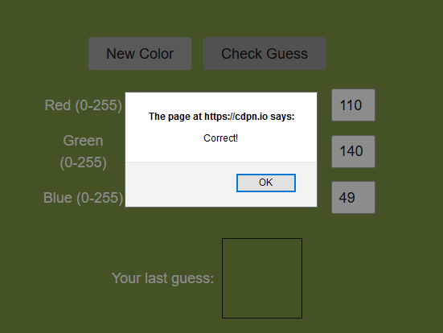

# Representing Data 1

## Magic number of the logo

The magic number of the logo is `89 50 4E 47`. This number confirms that it's a `.png` file. A magic number is generally composed of hexadecimal characters; it helps identify the type of the file we are dealing with.

## Color challenge completion

## Number of bits for each character in ASCII

8 bits. This is also the size of a byte.

## Manually converting an ASCII String

`01101000 01100101 01101100 01101100 01101111 00100001`

So we know that if it starts with `011` it's lowercase letters while `001` would be uppercase. All that is left for us to do is to spot the letter that corresponds to each index. We get:

* `1000` is 8, the 8th letter, **h**
* `101` is 5, the 5th letter is **e**
* `1100` is 12, the 12th letter is **l**
* `1100` is the same as before, **l**
* `1111` is 15, the 15th letter is **o**
* `00100001` has to be looked up as `21` in hex, which maps to **!**
* answer: `hello!`

## Converting "17" from ASCII

### To binary

Digits in ASCII always start with `0011`, so 1 is `00110001` and 7 is `00110111`. The solution is therefore `0b0011000100110111`

### To hex

From the binary solution, we have 1 is `31` and 7 is `37`. Solution: `3137`.

## Converting "Go Navy" from ASCII

* 'G' is the 7th (`0111`) uppercase (`0100`) letter. So we have `0100 0111` in binary.
* 'o' is the 15th (`1111`) lowercase (`0110`) letter. So we have `0110 1111` in binary.
* ' ' (space) needs to be looked up. It's `20` in hex.
* 'N' is the 14th (`1110`) uppercase (`0100`) letter. So we have `0100 1110` in binary.
*  'a' is the 1st (`0001`) lowercase (`0110`) letter. So we have `0110 0001` in binary.
* 'v' is the 21st (`1 0101`) lowercase (`011_`) letter. So we have `0111 0110` in binary.

* 'y' is the 25th (`1 1001`) lowercase (`011_`) letter. So we have `0111 1001` in binary.

### To binary

`0100 0111 0110 1111 0010 0000 0100 1110 0110 0001 0111 0110 0111 1001`

### To hex

`47 6F 20 4E 61 76 79`

### To octal

`0100 0111 0110 1111 0010 0000 0100 1110 0110 0001 0111 0110 0111 1001`

Because each byte is represented as 3 octal digits, the above is the same as

`01 000 111 01 101 111 00 100 000 01 001 110 01 100 001 01 110 110 01 111 001`

which gives us

`107 157 040 116 141 166 171`

## Transforming from base64

* Input String: "c2l4dHlmb3Vy"

* Approach: we need to lookup each character's index in the base64 alphabet. We get:
  28_54_37_56 --- 29_7_37_38 --- 27_55_21_50
  because we have to group them in groups of 4
* Next we extract the last 6 bits of each number
  `011100 110110 100101 110000
  011101 000111 100101 100110
  011011 110111 010101 011010`

* Next we group each 24 bits in 3 bytes
  `01110011 01101001 01111000 `
  `01110100 01111001 01100110 `
  `01101111 01110101 01110010`

* Finally we decode each byte as an ASCII character
  [19, 9, 16, 20, 25, 6, 15, 21, 18] => "sixtyfour"